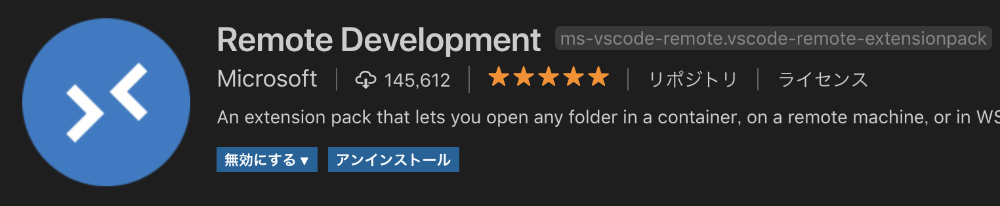
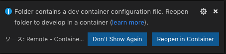
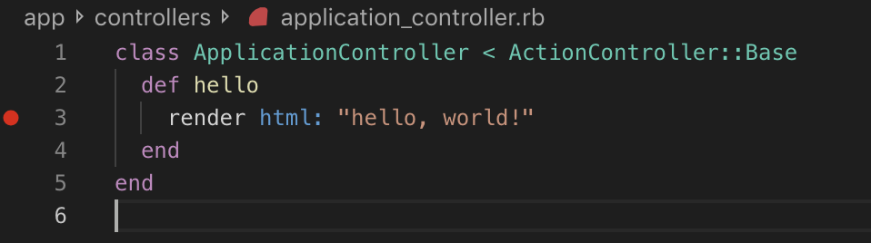
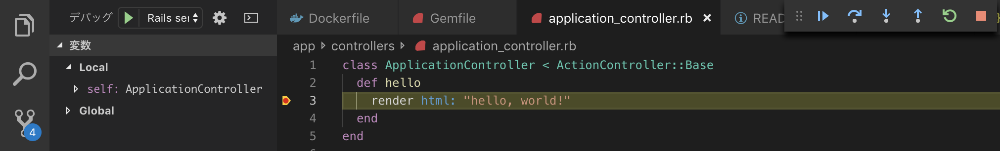

# Railsの勉強(Docker開発環境を使用)


## ●使用ツール

|ツール名|バージョン|備考|
|:--|:--|:--|
|Visual Studio Code|1.35.1||
|Remote Development|-|VSCode拡張機能|
|Docker for Mac|2.0.0.3|UbuntuのDockerでも動作確認済み|

## ●使用方法

1. Visual Studio Codeをインストール　※自分のOSに合わせてインストールしてください
2. Remote Development拡張機能をインストール(VSCode拡張機能)



3. Dockerをインストール　※Macの場合はDocker for Mac  
※Linuxの場合は`sudo`しなくても使用できるように設定を行ってください。

4. 本リポジトリをクローン

5. VSCodeで起動

6. VSCode右下のダイアログから[Reopen in Container]を選択



コンテナイメージのインストールが実行される

7. ブレイクポイントの設定

下記イメージのようにブレイクポイントを設定する



8. [F5]キーを押下し、実行

9. ブラウザやcurlを使用して[http://localhost:3000]にアクセス



ブレイクポイントで止まります。

---

# 勉強内容

##  MVCの理解

基本的にRailsコマンドを使用してお手本通りに勉強する。

- ✅Controller作成
- ✅Modelの作成
- ✅Viewの作成

### [Controllerの作成]

```bash
# bundle execは省略
rails g controller <controller名>
# /app/controllers配下に作成される
# 例
rails g controller hello
```

例)

```ruby
class HelloController < ApplicationController
  def index
    @hello = "Hello"
  end
end
```

### [Viewの作成]

Controllerを作成するとフォルダが切られる。  
例) `/app/views/hello`  
ERBファイルは自分で作成。

```bash
touch /app/views/hello/index.html.erb
```

例)

```html
<div>
  <%= @hello %>
</div>
```

Controllerの関数名(アクション名)とViewのファイル名(.html.erb以前)が一致する場合はRouteの設定不要。  
一致しない場合は`/config/routes.rb`を編集

例)

```ruby
Rails.application.routes.draw do
  get 'hello/:name' => 'hello#show'
end
```

アクセスする際のURLは以下となる。  
`http://localhost:3000/hello/index`

## [Modelの作成]

### ●命名規則

- テーブル名は複数形(小文字)
  - 例：users
- モデルクラス名は単数形(先頭大文字)
  - 例：User
- カラム名 = インスタンスのプロパティ名

### ●O/Rマッパーについて

- 標準は「Active Record」

### ●データベース設定

`/config/database.yml`に記述する。

- development(開発)
- test(テスト)
- production(本番)

用の設定がある

### ●作成コマンド

```bash
rails g model <モデル名> <カラム名>:<型>
# 例
rails g model member seq:integer name:string
```

コマンド実行後の挙動

- `/app/models`にモデルが作成される
- `/db/migrate`にマイグレーションファイルが作成される
- `/test/fixtures`にテストデータ投入用のフィクスチャが作成される
- `/test/models`にテスト用スクリプトが作成される

マイグレーションは以下のコマンドで実行

```bash
rails db:migrate
```

フィクスチャを使用して初期データを投入する場合は以下のコマンド

```bash
rails db:fixtures:load FIXTURES=<フィクスチャの名称>
```

